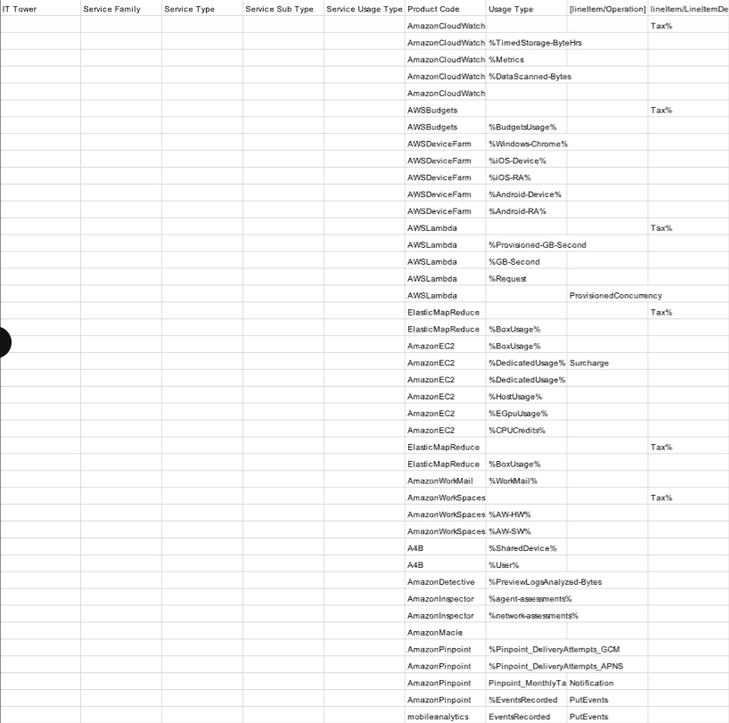
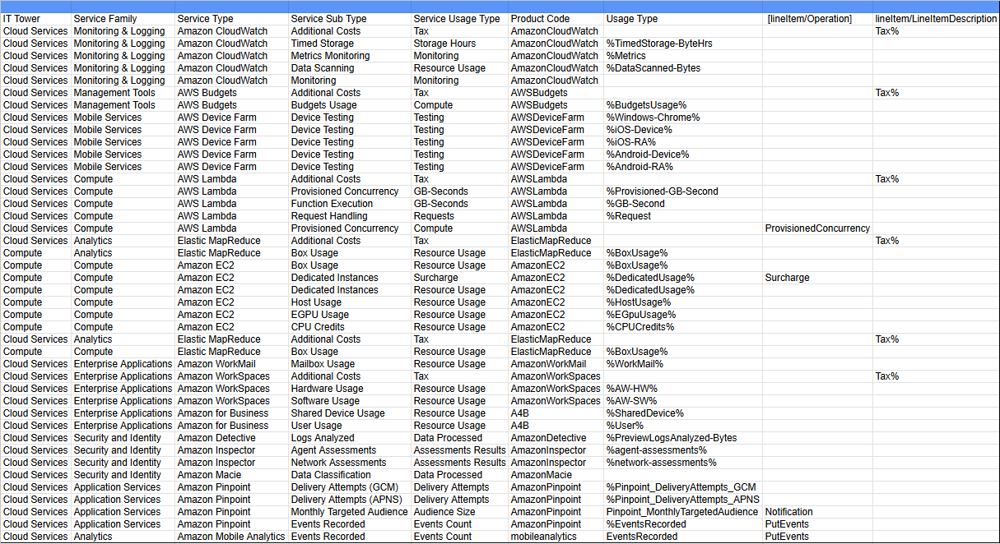

# Cloud Technologies and Services
### Лабораторная работа 1. 
### Знакомство с IaaS, PaaS, SaaS сервисами в облаке на примере Amazon Web Services (AWS). Создание сервисной модели.

#### Lyutiy Nick, Mitrofanova Polina, Trikula Artyom, Muldiyarov Arseniy
#### Вариант 4 (определялся по номеру ИСУ человека из команды)

## Условие

#### Цель работы: 
Знакомство с облачными сервисами. Понимание уровней абстракции над инфраструктурой в облаке. Формирование понимания типов потребления сервисов в сервисной-модели. 
#### Дано: 
Слепок данных биллинга от провайдера после небольшой обработки в виде SQL-параметров. Символ % в начале/конце означает, что перед/после него может стоять любой набор символов.
Образец итогового соответствия, что желательно получить в конце. В этом же документе  
#### Необходимо: 
Импортировать файл .csv в Excel или любую другую программу работы с таблицами. Для Excel делается на вкладке Данные – Из текстового / csv файла – выбрать файл, разделитель – точка с запятой.
Распределить потребление сервисов по иерархии, чтобы можно было провести анализ от большего к меньшему (напр. От всех вычислительных ресурсов Compute дойти до конкретного типа использования - Выделенной стойка в датацентре Dedicated host usage).
Сохранить файл и залить в соответствующую папку на Google Drive.

#### Алгоритм работы: 
Сопоставить входящие данные от провайдера с его же документацией. Написать в соответствие колонкам справа значения 5 колонок слева, которые бы однозначно классифицировали тип сервиса. Для столбцов IT Tower и Service Family значения можно выбрать из образца.

## Выполнение

Таблица, которая была изначально:

### Начнем с теории, которая нам была нужна

Это три фундаментальные модели облачных сервисов, образующие иерархию.

#### IaaS (Infrastructure as a Service)
- Провайдер предоставляет абстрактную вычислительную инфраструктуру: виртуальные процессоры, память, диски, сети.

- Пользователь контролирует практически все, что работает поверх этой инфраструктуры: операционные системы, среды выполнения, приложения, данные, конфигурации безопасности.

#### PaaS (Platform as a Service)
- Провайдер предоставляет готовую платформу - среду для разработки, запуска и управления приложениями. Включает ОС, инструменты, базы данных, веб-серверы.

- Пользователь контролирует исключительно разрабатываемый код приложения и данные.

#### SaaS (Software as a Service)
- Провайдер предоставляет полностью готовое к использованию программное обеспечение (приложение), доступное через сеть.

- Пользователь контролирует только собственные данные и настройки внутри предоставленного приложения.

### Теперь к работе

Для классификации было решено использовать: https://docs.aws.amazon.com/

Спустя много времени, проведенного в интернете в поисках нужной информации удалось классифицировать сервисы:

1. Amazon CloudWatch (Monitoring & Logging) -
сервис для мониторинга и логирования различных данных в AWS.
2. AWS Budgets (Management Tools) -
сервис для отслеживания и управления бюджетом.
3. AWS Device Farm (Mobile Services) -
сервис для тестирования мобильных приложений на различных устройствах.
4. AWS Lambda (Compute) -
сервис для запуска кода без управления серверами.
5. Elastic MapReduce (EMR) (Analytics) -
сервис для обработки больших данных с помощью фреймворков.
6. Amazon EC2 (Compute) -
сервис для запуска виртуальных серверов.
7. Amazon WorkMail (Enterprise Applications) -
сервис для управления корпоративной почтой.
8. Amazon WorkSpaces (Enterprise Applications) -
сервис виртуальных рабочих столов.
9. Amazon for Business (Enterprise Applications) -
сервис для использования устройств и пользователей в бизнес-среде.
10. Amazon Detective (Security and Identity) -
сервис для анализа и расследования инцидентов безопасности.
11. Amazon Inspector (Security and Identity) -
сервис для автоматической оценки безопасности.
12. Amazon Macie (Security and Identity) -
сервис для классификации и защиты данных.
13. Amazon Pinpoint (Application Services) -
сервис для управления маркетинговыми кампаниями и уведомлениями.
14. Amazon Mobile Analytics (Analytics) -
сервис для анализа мобильных приложений.

## Итоги

Получилась табличка: [тык](https://docs.google.com/spreadsheets/d/15FBEhsJ7SRfB8DEwjOuJHlYnp8K5-0uY/edit?usp=sharing&ouid=111723523811404051168&rtpof=true&sd=true)

Если неохото открывать:

В результате работы изучены ключевые модели облачных сервисов (IaaS, PaaS, SaaS). На основе этих принципов предоставленный каталог сервисов AWS был систематизирован.

Лабораторная работа завершена. Создана структурированная модель сервисов AWS, готовая к использованию для анализа их функционального назначения и потенциальных затрат.

