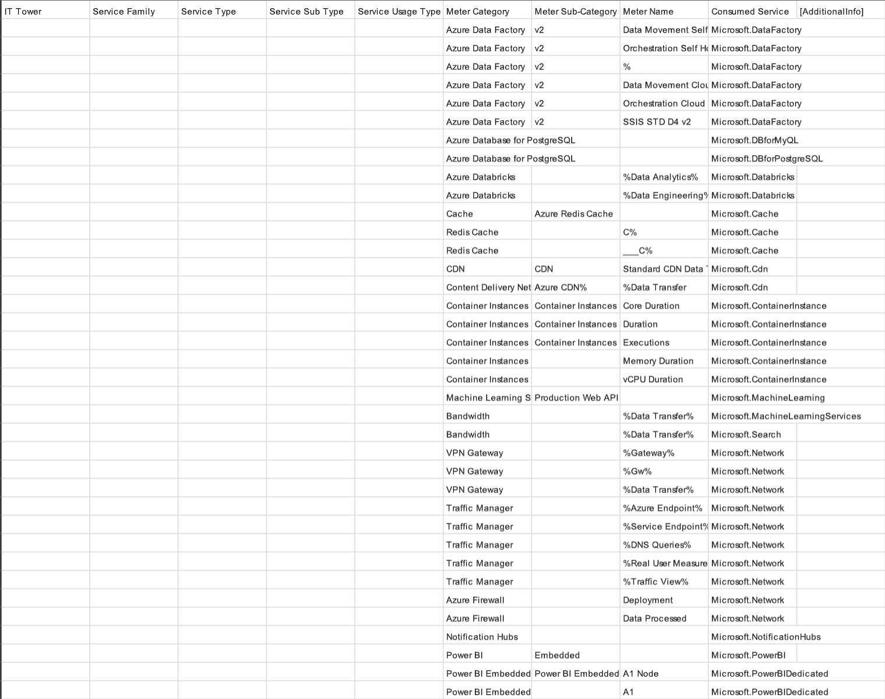
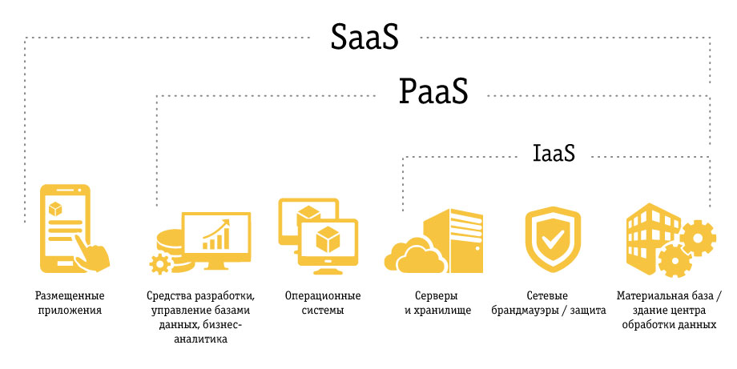
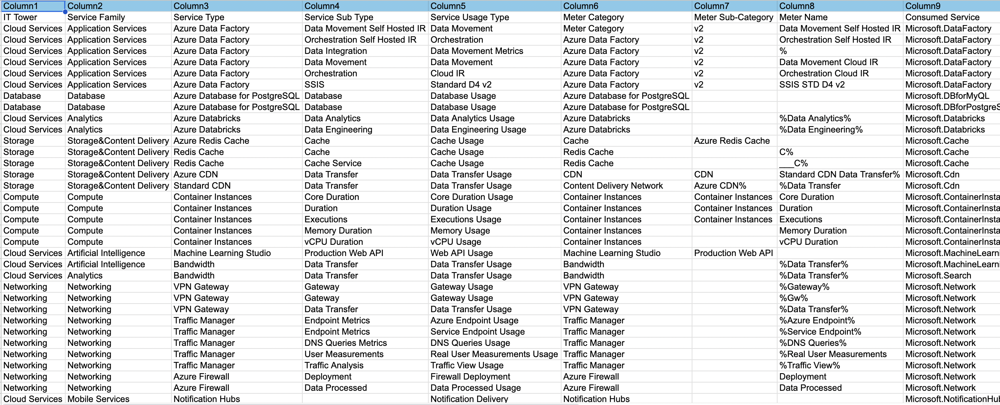

## Цель работы  
Познакомиться с облачными сервисами Microsoft Azure. Разобраться, какие бывают уровни абстракции в облаке и как сервисы относятся к моделям IaaS, PaaS и SaaS. Понять, как классифицируется потребление облачных ресурсов.

---

## Дано  
Был предоставлен файл с биллинговыми данными Microsoft Azure в формате CSV после предварительной обработки.  
В некоторых полях используются символы `%`, которые означают, что до или после них может быть любой набор символов.

---

## Необходимо  
1. Импортировать CSV-файл в Excel.  
   Для этого использовалась вкладка **Данные → Из текстового / CSV-файла**, разделитель - `;`.

2. Распределить потребление сервисов по иерархии, чтобы можно было анализировать данные от общего к частному (например, от группы Compute до конкретного типа использования ресурса).

3. Заполнить колонки:
   - IT Tower  
   - Service Family  
   - Service Type  
   - Service Sub Type  
   - Service Usage Type  

---

## Алгоритм работы  
1. Изучить биллинговые данные Azure.  
2. Сопоставить названия сервисов и метрик с официальной документацией Microsoft Azure.  
3. Для каждой строки определить:
   - к какому сервису относится потребление,
   - какой это тип сервиса,
   - как именно он потребляется (вычисления, передача данных, хранение и т.д.) 
4. Заполнить недостающие колонки так, чтобы каждая строка была логически классифицирована.  
5. Для колонок **IT Tower** и **Service Family** использовать значения из примера.

---

## Теоретическая часть  

Начнем снова с основ

### IaaS (Infrastructure as a Service)  
Провайдер предоставляет базовую инфраструктуру: виртуальные машины, сеть, хранилища.  
Пользователь сам управляет операционной системой и приложениями.

**Примеры в Azure:**  
- Virtual Machines  
- VPN Gateway  
- Azure Firewall  

---

### PaaS (Platform as a Service)  
Провайдер предоставляет готовую платформу для разработки и запуска приложений.  
Пользователь работает в основном с кодом и данными.

**Примеры в Azure:**  
- Azure Data Factory  
- Azure Databricks  
- Azure Database for PostgreSQL  
- Azure Machine Learning Studio  

---

### SaaS (Software as a Service)  
Готовые приложения, доступные через интернет.  
Пользователь почти не управляет инфраструктурой.

**Примеры в Azure:**  
- Power BI  
- Notification Hubs  

---

## Практическая часть  

Для классификации использовалась дока Microsoft Azure:  
<https://learn.microsoft.com/azure/>

На основе биллинговых данных удалось определить, какие сервисы Azure использовались и к каким категориям они относятся.

---

## Результаты работы  

В ходе работы были классифицированы следующие сервисы:

- **Azure Data Factory** - PaaS  
  Используется для интеграции и оркестрации данных в облаке Azure.

- **Azure Databricks** - PaaS  
  Применяется для аналитики и обработки данных.

- **Azure Database for PostgreSQL** - PaaS  
  Используется для развертывания и управления базами данных PostgreSQL в облаке Azure.

- **Azure Container Instances** - сервис для запуска контейнеров, потребление учитывается по CPU, памяти и времени работы.

- **Azure Redis Cache** - сервис для кэширования данных.

- **Azure CDN** - сервис для передачи данных через сеть доставки контента.

- **VPN Gateway, Traffic Manager, Azure Firewall** - сетевые сервисы, связанные с маршрутизацией, безопасностью и передачей данных.

- **Machine Learning Studio** - сервис для работы с моделями машинного обучения.

- **Power BI и Power BI Embedded** - SaaS-сервисы для визуализации и анализа данных.

- **Notification Hubs** - сервис для отправки уведомлений.

Все сервисы я распределила по уровням IT Tower и Service Family, что позволило мне структурировать данные и упростить их анализ.

---

## Итог  
[**Итоговая табличка**](https://docs.google.com/spreadsheets/d/1oga9Z_9B7GNf3yGuopLXiFKDjXS6Mig9/edit?usp=sharing&ouid=115950687976351403973&rtpof=true&sd=true)

Если лень открывать :)

В ходе выполнения лабораторной работы были изучены основные модели облачных сервисов: **IaaS, PaaS и SaaS**.  
Биллинговые данные Microsoft Azure были структурированы и распределены по иерархии сервисов.

В результате получилась таблица, которая позволяет понять, за какие типы ресурсов происходит оплата и на каком уровне абстракции работает каждый сервис.

Все, работа сделана

p.s. это последняя лаба на курсе, поэтому здесь напишу маленькое спасибо за семестр, люблю облачка <3

