# Cloud Technologies and Services
### Лабораторная 1, версия со звездочкой.

#### Lyutiy Nick, Mitrofanova Polina, Trikula Artyom, Muldiyarov Arseniy

## Начало выполнения

Выполнение лабораторной работы началось спонтанно, когда Артем заметил на сайте факультета `fpin-itmo.ru` возможность перехода в панель авторизации администратора, прописав `/admin` в адресной строке. 

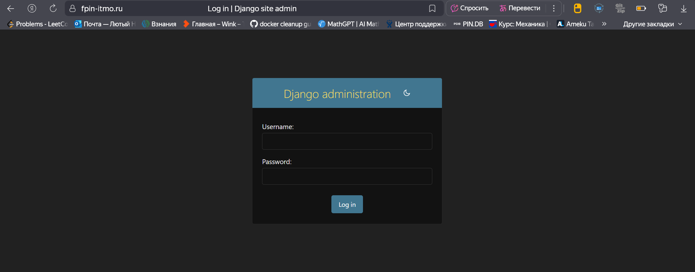

#### Заметив это нам стало интересно поискать еще такие возможности открытия странных разделов сайта. Но мы выбрали 2 разных маршрута:
- Артем увидев, что авторизация сделана на django решил перебирать адресную строку ручками.
- Я захотел попробовать автоматизировать процесс, прочитав из текста лабораторной про существование `ffuf`.

### Результаты Артема

По итогу перебора страницы ему удалось обнаружить маршрут `/api` на сайте, но, к сожалению, попытки перейти по путям, указанным там не увенчались более успехом :(
    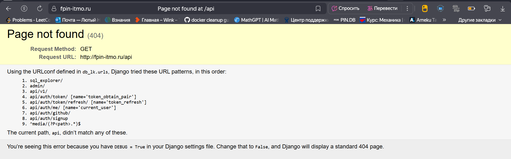

### Мои результаты

Первым делом я полез выяснять, что за штука такая ffuf и как ей вообще пользоваться. Сначала нашел репозиторий на GitHub, ну а дойти до ссылки на скачивание нормальной версии программы для Win11 уже не составило труда. 

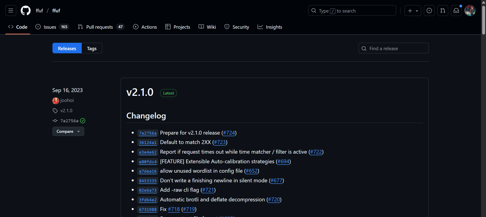

Скачав версию программы я подумал: "Круто, уже можно пользоваться". Но оказалось все немного сложнее. Для ее работы необходим список популярных названий страниц сайта. 

Составлять его самому сразу показалось глупой идеей, ведь 1000% нашелся уже какой-то умный бородатый дядька, который составил такой список. 

Поиски с помощью ~~ChatGPT~~ "умного друга" снова привели меня в какой-то GitHub репозиторий, где было как раз то, что мне нужно.

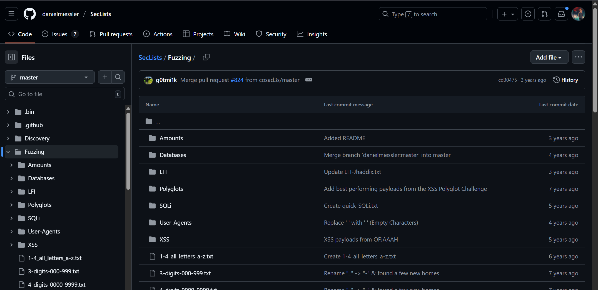

P.S. я не ошибся, сказав, что какой-то умный бородатый дядька уже это делал)


## Работа с ffuf

Для запуска ffuf использовалась команда:

```bash
ffuf.exe -u https://example.com/FUZZ -w common.txt -mc 200,302,403
```

Т.е. на место слово FUZZ вставали слова из файла, а благодаря фильтру по кодам ошибок не было "мусорных" выводов.

### Проверка сайта abit.itmo

Для проверки программы я решил проверить сайт `abit.itmo.ru` (просто сайт fpin выглядит так, будто вообще мог сломаться насовсем) и не прогадал :)

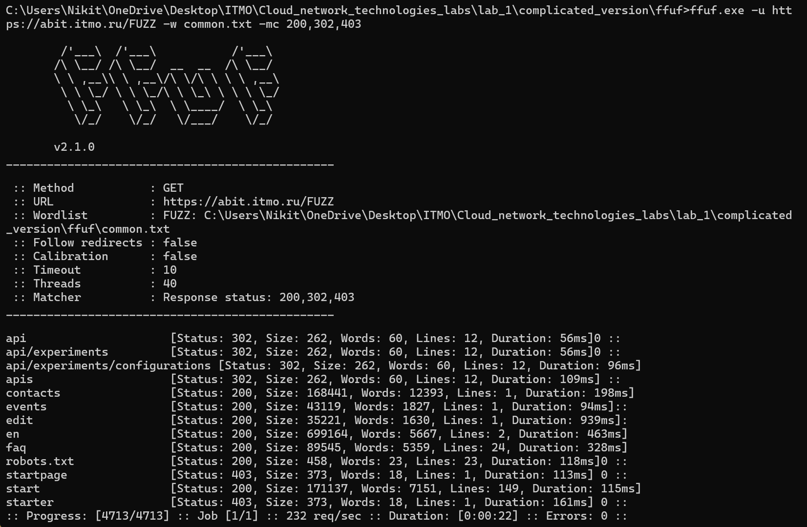

Проверив ручками подозрительные страницы было найдено кое-что интересное: есть возможность перехода на страницу `/edit`. 


И даже есть возможность что-то потыкать на этой странице.


Но жаль, что лишь до момента выбора языка :(

Дальше уже вылезает страница авторизации админа.

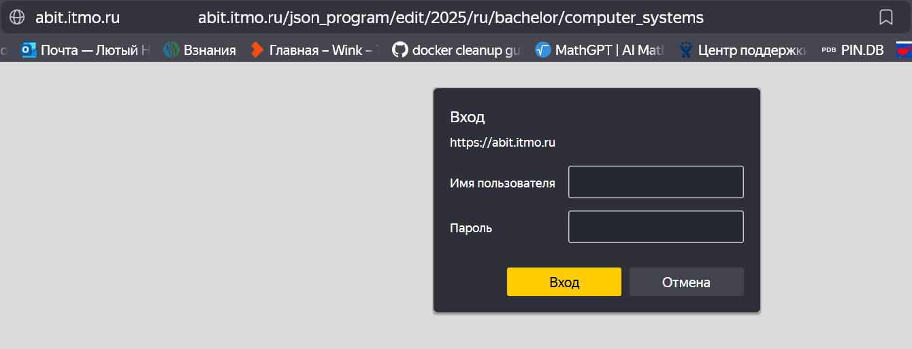

Остальные адреса не дали ничего интересного и я погнал дальше :)

### Проверка сайта fpin.itmo

Тут проверка шла заметно дольше, чем на abit.itmo, но была по большей части безрезультатная :(

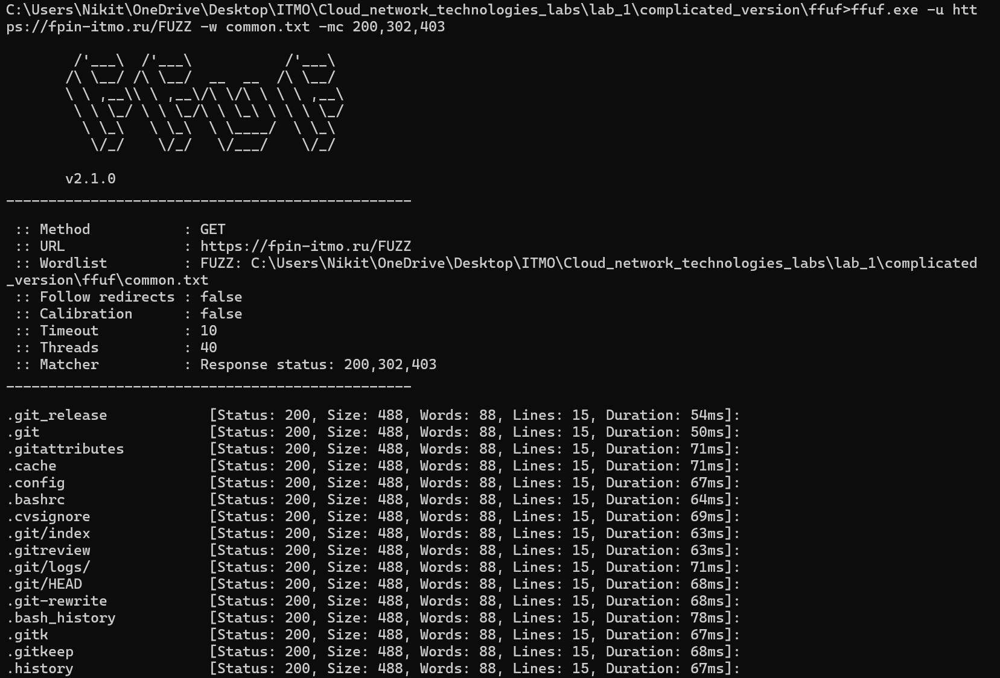

Хоть и очень много маршрутов с кодом 200, на самом же деле при переходе на них ты попадаешь на просто белую страницу. 

Могли бы и что-то поинтереснее придумать (-_-)


Я расстроился, но подумал, что хочется проверить еще сайты так, но не тут-то было...


Честно говоря, сердце улетело в пятки, ибо я знал, что к этому преподавателю мне идти завтра на пару. 

Но к счастью оказалось, что это был розыгрыш от Артема и я теперь просто его ненавижу и хочу убить :)

### Проверка сайта study.physics.itmo

Тут мой выбор был неожиданным даже для меня. Почему решил устроить проверку сайтам именно ITMO - вообще без понятия. Ну а у нас как раз началась физика, так почему их сайт бы и не прогнать через `ffuf` :)

Тут ситуация была наиболее интересной из всех.

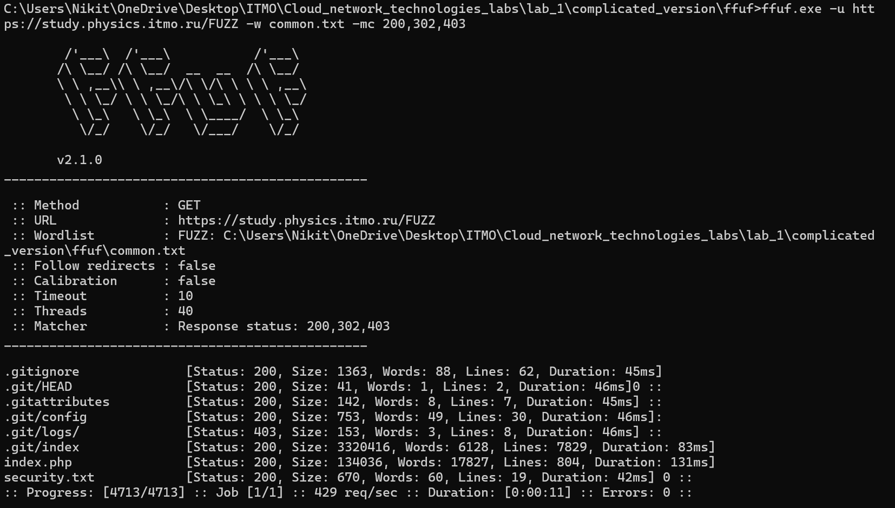

Тут программа выдала необычные маршруты, большая часть которых была связана с Git. Я решил проверить, что же там лежит и оказалось, что при переходе по адресам `.gitattributes`, `.config`, `.git/HEAD` и т.д. реально скачиваются файлы с репозитория сайта физики.

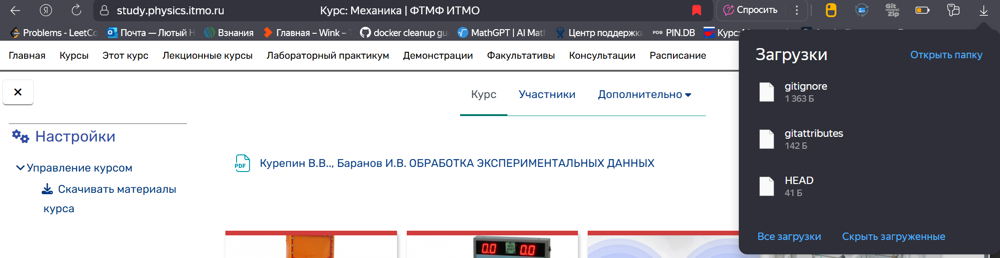

Пусть по сути это тот же перебор маршрутов сайта, но уязвимость может быть более критичной, чем в случае просто оставленных бесхозных файлов, так что можно выделить как подкатегорию уязвимости и проверить.

Мне захотелось попробовать восстановить репозиторий с помощью git_dump, но там все тухло :(

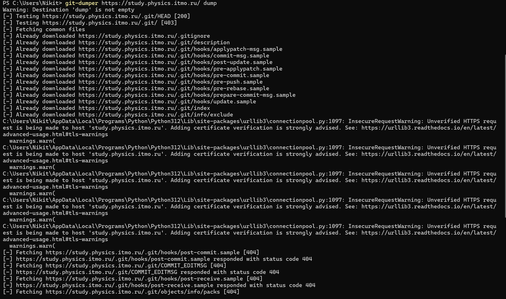

> P.S. Все, что получилось вытянуть лежит в директории `physics_dump`

### Работа с `securityheaders.com`

Проверка заголовков была проведена над теми же сайтами ITMO.

Результаты проверки:

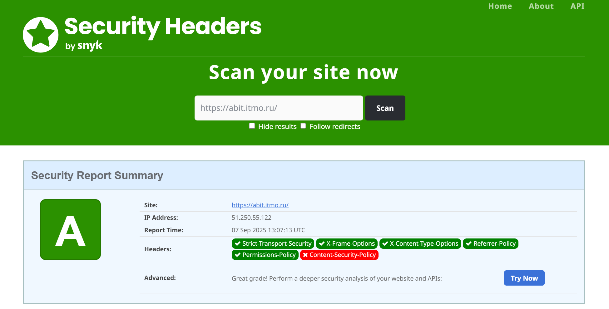


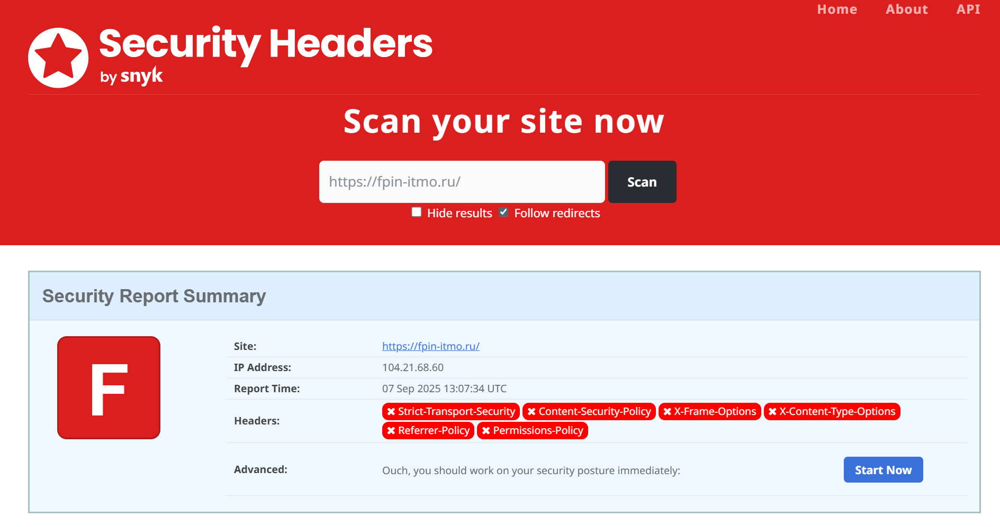

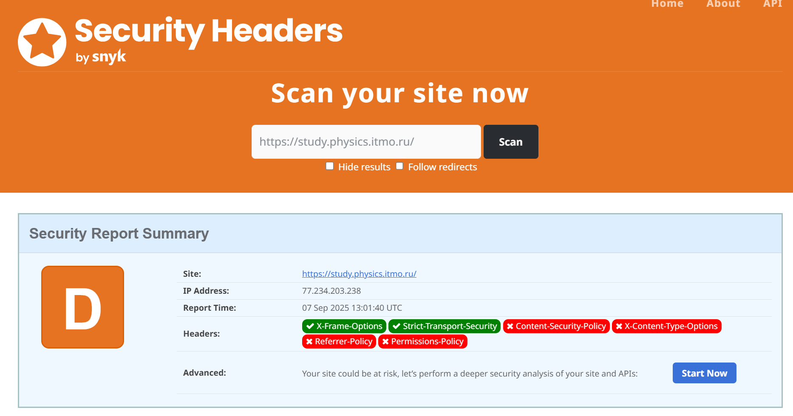

Как можно заметить по результатам, на сайте `abit.itmo` с заголовками все хорошо, чего не сказать о сайте физики, и тем более о сайте факультета, на котором отсутствует множество очень важных заголовков, например X-Content-Type-Options, X-Frame-Options, Strict-Transport-Security, что делает сайт уязвимым для атак.


### Проверка SQL Injection для `abit.itmo`

Во время работы с сайтом была замечена 1 интересная вещь в адресной строке, а именно названия курсов, которые фактически могут являться запросами к БД. 


Я решил воспользоваться `sqlmap` для автоматической проверки.


> ВАЖНО! `sqlmap` я запускал без агрессивных параметров, так что сломаться ничего не должно было

По результатам проверки `sqlmap` не было выявлено инъекции в параметре directions.

### Вывод

- Удалось попробовать себя в роли инфобезника, хоть возможно и не самые удачные сайты были выбраны. 
- За счет задания я узнал больше про уязвимости, а также как их можно проверить.
- Знатно пощекотал нервы из-за розыгрыша Артема.
- Ну и суммарно интересно провел время :)