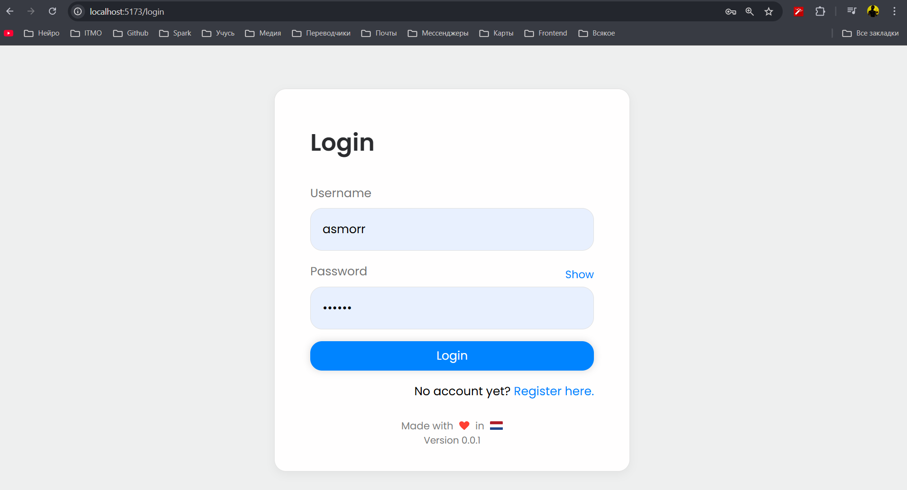
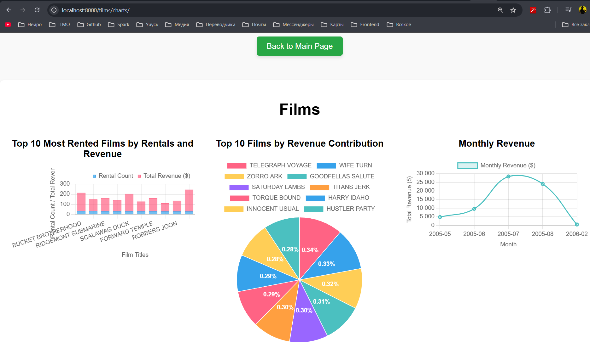

# Cloud Technologies and Services
### Лабораторная 1, обычная версия.

#### Lyutiy Nick, Mitrofanova Polina, Trikula Artyom, Muldiyarov Arseniy

## Начало выполнения

Всё началось с выбора платформы. Вначале я хотел делать на windows, но после небольшого ресёрча оказалось, что всё-таки
nginx, как инструмент, больше заточен под linux (удивительно)
Тогда мне показалось, что гораздо более полезно будет выполнять работу на linux-подобных системах.
Следующий вопрос: какие проекты хостить? Собственных подходящих как-то не нашлось, а просто выводить html-страничку —
слишком скучно :(
Ну и я вышел в интернет с этим вопросом. Нашлись 2 простеньких проекта, которые, однако,
используют весь набор реальных инструментов: back-end на Python (Django / FastAPI), front-end на Vue и даже 
базу данных (PostgreSQL / MySQL).

### Проект номер раз
> [!WARNING]  
> Front-end живёт на 5173 порту, Back-end на 8000, Postgres на 5432

### Проект номер два
А тут Front-end вместе Back-end'ом вместе на 8000, А MySQL на 3306
