# Cloud Technologies and Services

### Лабораторная 1, обычная версия.

#### Lyutiy Nick, Mitrofanova Polina, Trikula Artyom, Muldiyarov Arseniy

> [!WARNING]
> Этот отчёт не является ни обвинением, ни исповедью. Это только попытка рассказать о времени, которое погубил linux, о
> тех, кто стал его жертвой (обо мне), даже если спасся от докера.

## Начало выполнения

Всё началось с выбора платформы. Вначале я хотел делать на windows, но после небольшого ресёрча оказалось, что всё-таки
nginx, как инструмент, больше заточен под linux

Тогда мне показалось, что гораздо более полезно будет выполнять работу на linux-подобных системах, а именно на
виртуальной машинке с Ubuntu.
Следующий вопрос: какие проекты хостить? Собственных подходящих как-то не нашлось, а просто выводить html-страничку —
слишком скучно :(

Ну и я вышел в интернет с этим вопросом. Нашлись 2 простеньких проекта, которые, однако,
используют весь набор реальных инструментов: back-end на Python (Django / FastAPI), front-end на Vue и даже
базу данных (PostgreSQL / MySQL).

### [Проект номер раз](https://github.com/SteynGuelen/Boilerplate-FastAPI-Vue3-Vite-Postgres)

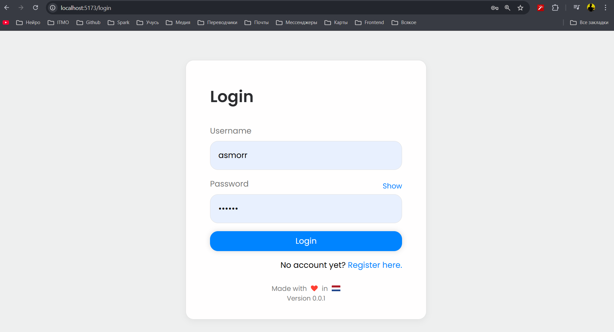
> [!TIP]
>
> - Front-end живёт на 5173 порту
> - Back-end — на 8000
> - Postgres — на 5432

### [Проект номер два](https://github.com/hbilu/DjangoWebApp_FrontendBackend)

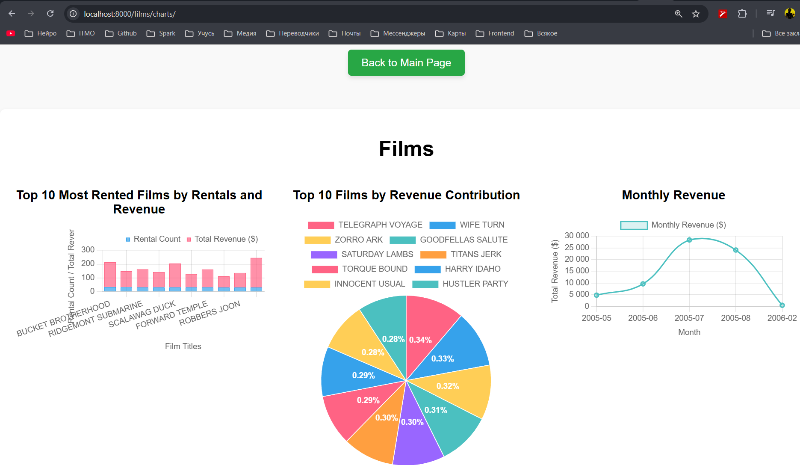
> [!TIP]
>
> - А тут Front-end вместе Back-end'ом вместе на 8000
> - MySQL — на 3306

## Первые шаги

После этого у меня начал примерно складываться план выполнения работы. Так как выбранные проекты оказались
рабочими и спокойно запускались с помощью docker compose, мне захотелось иметь возможность их запуска из разных
docker-compose файлов, не объединяя их в один. Такой подход позволил бы при необходимости более удобно развивать проекты
независимо, не привязываясь к одному огромному docker-compose файлу. А значит нам понадобится объединить контейнеры в
сеть. В связи с этим быстренько возник план:

1) Добавить свои тестовые доменные имена [->](#добавление-доменов)
2) Создать сеть для контейнеров [->](#создание-docker-сети)
3) Внести небольшие правки в docker-compose файлы
   проектов: [раз](Boilerplate-FastAPI-Vue3-Vite-Postgres/docker-compose.yml)
   и [два](DjangoWebApp_FrontendBackend/docker-compose.yml) [->](#правим-docker-compose) 
4) Создать третий [docker-compose файл с nginx](nginx/docker-compose.yml) [->](#создание-docker-compose-с-nginx)
5) Написать базовый [конфиг nginx](nginx/default.conf) [->](#создание-базового-конфига-nginx)
6) Добавить алиасы для статического контента [->](#работа-со-статикой)
7) Добавить самоподписанный сертификат и работу с https [->](#танцы-с-бубнами-сертификатами)

## Первые проблемы

Работа с linux началась совсем не так, как хотелось. Вначале я обранаружил, что моя старая виртуалка даже не пытается
запускается.

<figure>
    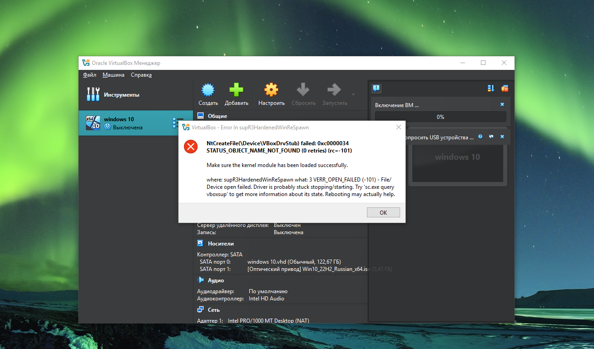
    <figcaption style="text-align: center">Картинка из интернета, но у меня была очень похожая ошибка</figcaption>
</figure>

Ну в целом ладно, ничего страшного, сделаем новую. Нашёл на ноутбуке образ, установил. Казалось бы, вот,
можно выполнять лабораторную работу, но (внезапно) оказалось, что на чистой машине ничего не установлено и нет никаких
аккаунтов. Окей, начинаем установку. Всё шло неплохо до того момента, как мне понадобилось стянуть с github этот
репозиторий. Это получилось не с первого раза, но тоже достаточно быстро. А вот попытки запушить изменения затянулись
где-то на час. В итоге пришлось вспоминать, как работать с ssh, потому что по http у меня так и не вышло залогиниться :(
Ну и ладно, сделал новый ключ, добавил его в аккаунт github, и вот изменения лежат в репозитории. Отредактировал
`/etc/host`, добавив туда тестовые домены (`project1.local`, `project2.local`). Далее следовал достаточно длительный
этап редактирования docker-compose файлов, а также написания nginx конфигурации, но об этом чуть ниже. В итоге
запускаю
все docker compose файлы и... Понимаю, что на виртуальной машине проекты просто некорректно работают:
<figure>
    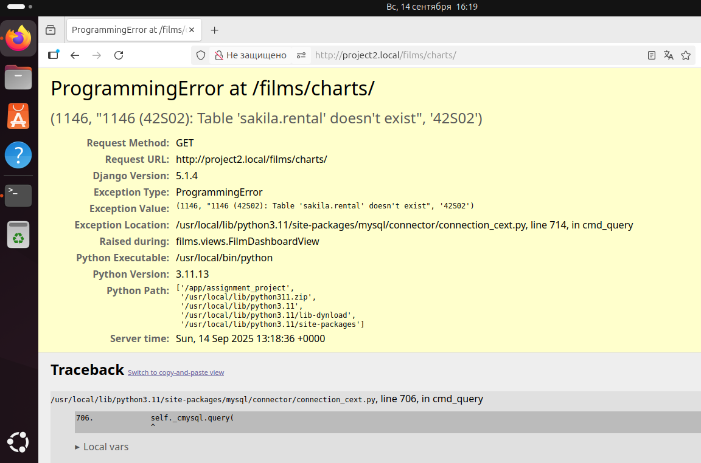
    <figcaption style="text-align: center">В одном из проектов просто отсутствуют таблицы базы данных</figcaption>
</figure>
Тестирую на windows - всё хорошо... Ну и в общем, было решено оставить идею с виртуальной машиной и всё-таки сделать
работу на windows, но с использованим Docker. Такой своеобразный компромис. Ну так вот, подробнее о работе:

## Выполнения работы

### Добавление доменов

Для начала нужно было добавить тестовые доменные имена в системный файл hosts. Этот файл является статической таблицей
сопоставлений доменных имён IP-адресам и обрабатывается до обращения к DNS-серверам. Находим файл `hosts` в директории
`C:\Windows\System32\drivers\etc\hosts` и добавляем туда строки:

- `127.0.0.1 project1.local`
- `127.0.0.1 project1.local`:

<figure>
    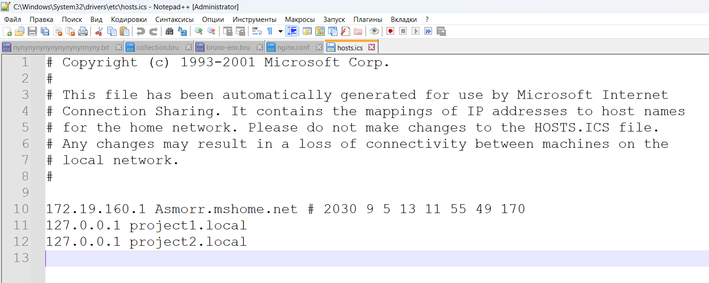
    <figcaption style="text-align: center">Обновлённый файл hosts</figcaption>
</figure>

### Создание Docker сети

Теперь нужно создать сеть Докер контейнеров. Для этого воспользуемся командой `docker network create shared_proxy_net`.
После этого нужно отредактировать docker-compose файлы, добавив туда как саму сеть, так и имена контейнеров в ней для
более удобного взаимодействия между ними

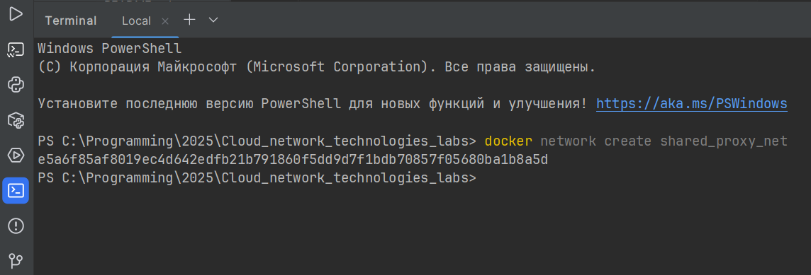

#### Правим docker-compose
В docker-compose файле первого проекта (с frontend/backend) добавим `networks` в нужные сервисы:

```yaml
services:
  frontend:
    # ...
    networks:
      shared_proxy_net:
        aliases:
          - project1_frontend

  backend:
    # ...
    networks:
      shared_proxy_net:
        aliases:
          - project1_backend

# В конце файла
networks:
  shared_proxy_net:
    external: true
```

В docker-compose файле второго проекта (где frontend/backend на одном порту django) добавим одни надстроку `networks`:

```yaml
services:
  web:
    # ...
    networks:
      shared_proxy_net:
        aliases:
          - project2_web

# В конце файла
networks:
  shared_proxy_net:
    external: true
```

### Создание базового конфига nginx

Теперь перейдём к написанию базового конфига nginx

```nginx
server {
    listen 80;
    listen [::]:80;
    server_name project1.local;
    location / {
        proxy_pass http://project1_frontend:5173;
    }
}

server {
    listen 80;
    listen [::]:80;
    server_name project2.local;
    location / {
        proxy_pass http://project2_web:8000;
        proxy_set_header Host $host;
    }
}
```

Здесь описаны два виртуальных сервера: первый для front-end приложения для первого проекта, второй - back-end +
front-end django второго проекта. Nginx слушает 80 порт в зависимости от имени хоста переправляет запрос по внутренний
сети Docker.

### Создание docker-compose с nginx

Для запуска nginx так же воспользуемся docker-compose с сервисом `nginx`, куда в дальнейшем добавим volumes для хранения
статических данных.

```yaml
version: "3.9"
services:
  nginx:
    image: nginx:1.25-alpine
    container_name: nginx-proxy
    ports:
      - "80:80"
      - "443:443"
    volumes:
      - ./default.conf:/etc/nginx/conf.d/default.conf:ro
    networks:
      - shared_proxy_net

networks:
  shared_proxy_net:
    external: true
```

Здесь прослушиваются два порта: 80 для http соединения и 443 - для https. Так же nginx добавлен в ранее созданную сеть
контейнеров `shared_proxy_net`

### Работа со статикой

Теперь создадим директории с картинками - `static` - и добавить алиасы чтобы nginx напрямую отдавал файлы (статику). В
nginx/default.conf добавляем location /static/ для каждого виртуального хоста:

```nginx
server {
    ...

    location /static/ {
        alias /var/www/project1_static/;
        try_files $uri $uri/ =404;
    }

    ...
}

server {
    ...

    location /static/ {
        alias /var/www/project2_static/;
        try_files $uri $uri/ =404;
    }

    ...
}
```

Чтобы путь `/var/www/project1_static/` внутри контейнера указывал на project1/static на хосте, добавим в docker compose
для nginx соответствующие тома:

```yaml
volumes:
  - ./default.conf:/etc/nginx/conf.d/default.conf:ro
  - ../project1/static:/var/www/project1_static:ro
  - ../project2/static:/var/www/project2_static:ro
```

`ro` означает «read-only» — nginx будет только читать файлы.
И теперь можем в браузере насладиться нашими картинками, выдаваемыми nginx'ом

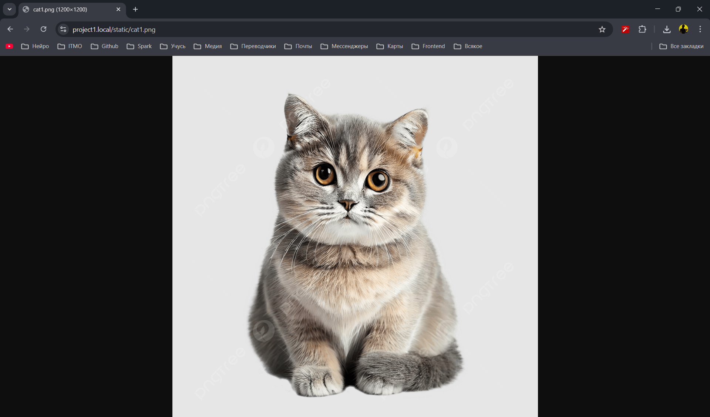
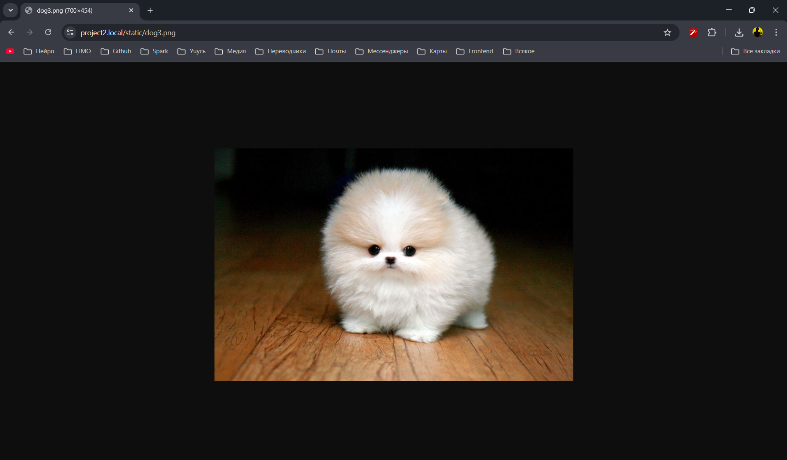

### Танцы с ~~бубнами~~ сертификатами

А теперь давайте сгенерируем самоподписанный сертификат и добавим перенаправление HTTP-запросов с 80 порта на 443 порт
HTTPS для безопасного соединения.

Вначале сгенерируем сертификат. Для этого подготовим [конфиг генерации ключа](nginx/certs/openssl.cfg), передём в
директорию `nginx/certs` и выполним команду (для удобства используем wsl):

```bash
openssl req -x509 -nodes -days 3650 \
  -newkey rsa:2048 \
  -keyout certs/privkey.pem \
  -out certs/fullchain.pem \
  -config certs/openssl.cnf \
  -extensions v3_req
```

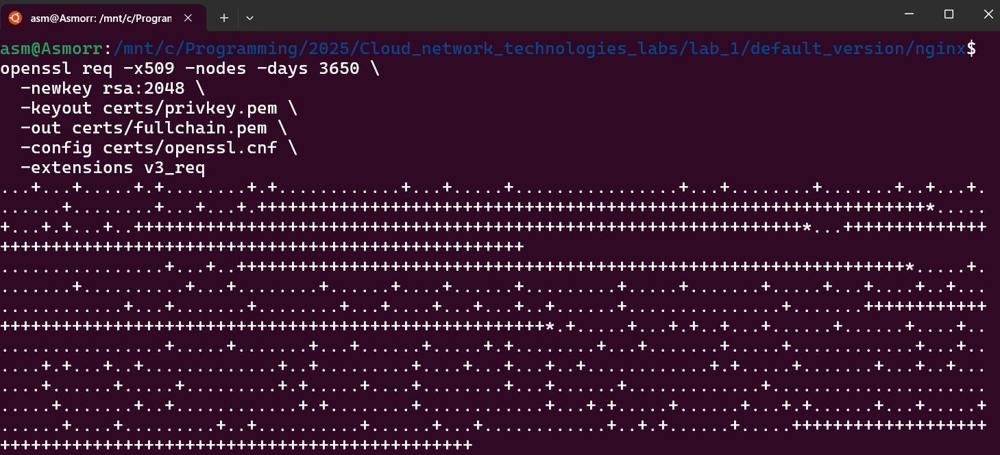

- Параметр `-x509` отвечает за создание сертификата в X.509 (а не CSR).
- `-config` — использует заранее подготовленный конфиг
- `-nodes` — отключает шифрование приватного ключа, чтобы nginx мог читать его без ввода пароля.
- `-newkey rsa:2048` позволяет одновременно с сертификатом создать новый приватный ключ RSA.

После выполнения создаются два файла: [приватный ключ](nginx/certs/privkey.pem)
и [сам сертификат](nginx/certs/fullchain.pem). Добавим их в конфиг nginx, предварительно подготовив редирект с 80 порта:

```nginx
server {
    listen 80;
    server_name project1.local project2.local;
    return 301 https://$host$request_uri;
}

server {
    listen 443 ssl;
    server_name project1.local;

    ssl_certificate /etc/nginx/certs/fullchain.pem;
    ssl_certificate_key /etc/nginx/certs/privkey.pem;

    ...
}

server {
    listen 443 ssl;
    server_name project2.local;

    ssl_certificate /etc/nginx/certs/fullchain.pem;
    ssl_certificate_key /etc/nginx/certs/privkey.pem;

    ...
}

```

И теперь когда мы переходим на `http://project1.local` происходит редирект и мы видим...


... что забыли пробросить 443 порт в docker-compose 🥰

Быстренько правим:

```yaml
ports:
  - "80:80"
  - "443:443"
```

И видим...

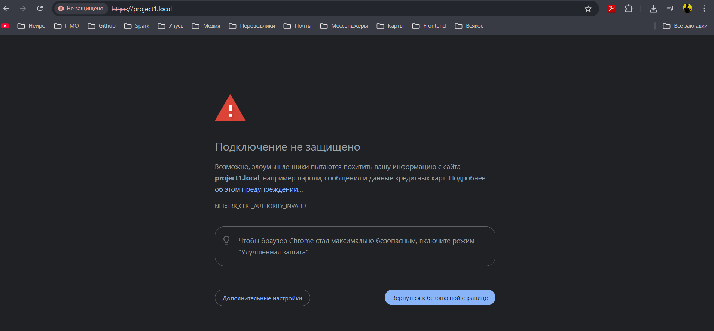
... сообщение о том, что сайт принадлежит злоумышленникам.

Чтобы это исправить, необходимо вручную добавить созданный
ранее сертификат в хранилище доверенных центров сертификации на Windows. Для этого переходим в Microsoft Management
Console для управления сертификатами и добавляем наш:

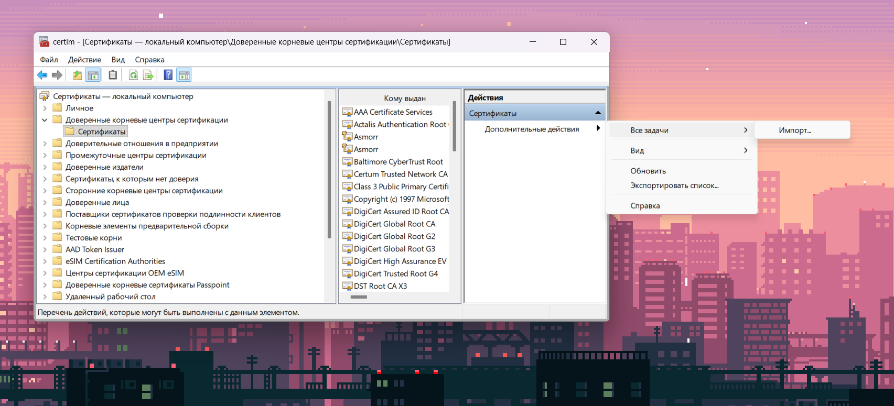
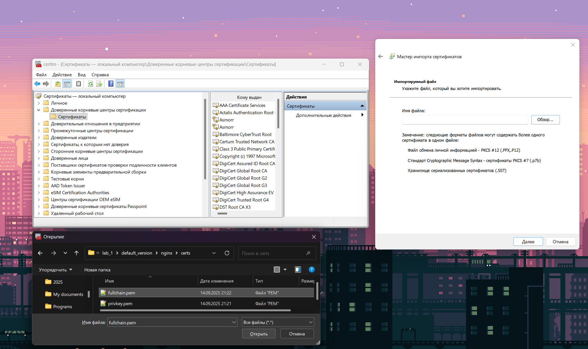
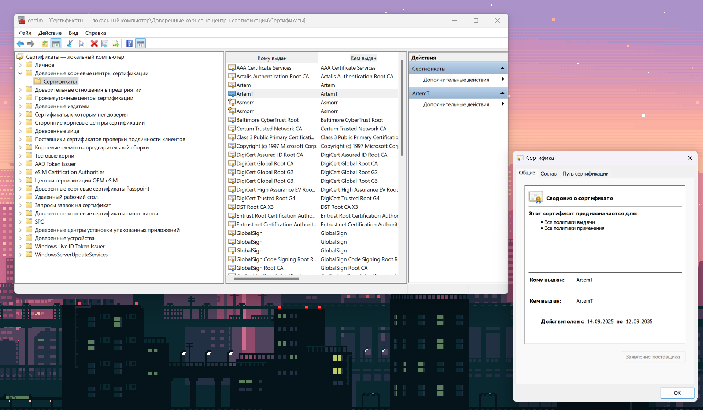

## И спустя несколько дней радости и веселья - победа, наконец-то наши сайты работают и браузер не ругается!

<div>
    
    
</div>
